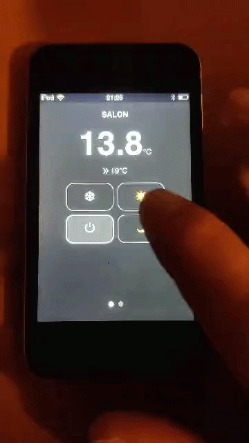

# iPod Thermostat

Une interface web compacte pour piloter un thermostat Home Assistant depuis un appareil de type iPod / mobile.

## Présentation

Ce projet sert de passerelle entre un petit front-end mobile et Home Assistant. Il affiche la température actuelle et permet de changer le mode de chauffage pour deux pièces :

- `Salon`
- `Véranda`

Le serveur Express expose des API simples qui appellent Home Assistant via son API REST.

## Demo



## Installation

1. Installer les dépendances :

```bash
npm install
```

2. Créer un fichier `.env` à la racine du projet si besoin :

```env
HA_URL=https://ton-home-assistant.local
HA_TOKEN=xxxxxxxxxxxxxxxxxxxxxxxxxxxxxxxxxxxxxxxxxxxxxxxxxxxxxxxxxxxx
```

> Si l'application tourne en tant qu'add-on ou dans un conteneur où `/data/options.json` est disponible, elle lit aussi les variables depuis ce fichier.

## Configuration

Le serveur utilise les variables d'environnement suivantes :

- `HA_URL` : URL de base de Home Assistant, par exemple `https://mon-ha.local`
- `HA_TOKEN` : token d'accès long-lived pour l'API Home Assistant

## Lancement

```bash
node server.js
```

Le serveur écoute par défaut sur le port `8080`.

## API

### Récupérer les températures

`GET /api/temps`

Réponse JSON :

```json
{
  "salon": {
    "current": 21.5,
    "currentMode": "confort"
  },
  "veranda": {
    "current": 18.3,
    "currentMode": "eco"
  }
}
```

### Définir une température

`GET /api/set_temp?room=salon&value=19`

Paramètres :

- `room` : `salon` ou `veranda`
- `value` : valeur de température en degrés Celsius

### Définir un mode

`GET /api/set_mode?room=salon&value=confort`

Paramètres :

- `room` : `salon` ou `veranda`
- `value` : `off`, `confort`, `eco`, `horsgel`

## Personnalisation des entités Home Assistant

Les entités utilisées sont définies dans `server.js` :

- `sensor.0xb48931fffe3bf627_temperature` pour la température du salon
- `input_select.chauffage_salon` pour le mode du salon
- `sensor.0xb48931fffe3bf1a9_temperature` pour la température de la véranda
- `input_select.chauffage_veranda` pour le mode de la véranda
- `climate.thermostat_salon` et `climate.thermostat_veranda` pour le réglage de température

Adapte ces identifiants si ton installation Home Assistant utilise d'autres entités.

## Structure du projet

- `server.js` : backend Express
- `public/index.html` : interface web
- `public/style.css` : styles de l'interface
- `package.json` : dépendances

## Dépendances

- `express`
- `axios`
- `dotenv`

## Remarques

- L'interface front-end est optimisée pour un affichage tactile mobile.
- Le projet peut facilement être déployé dans un conteneur ou sur un petit serveur local.
